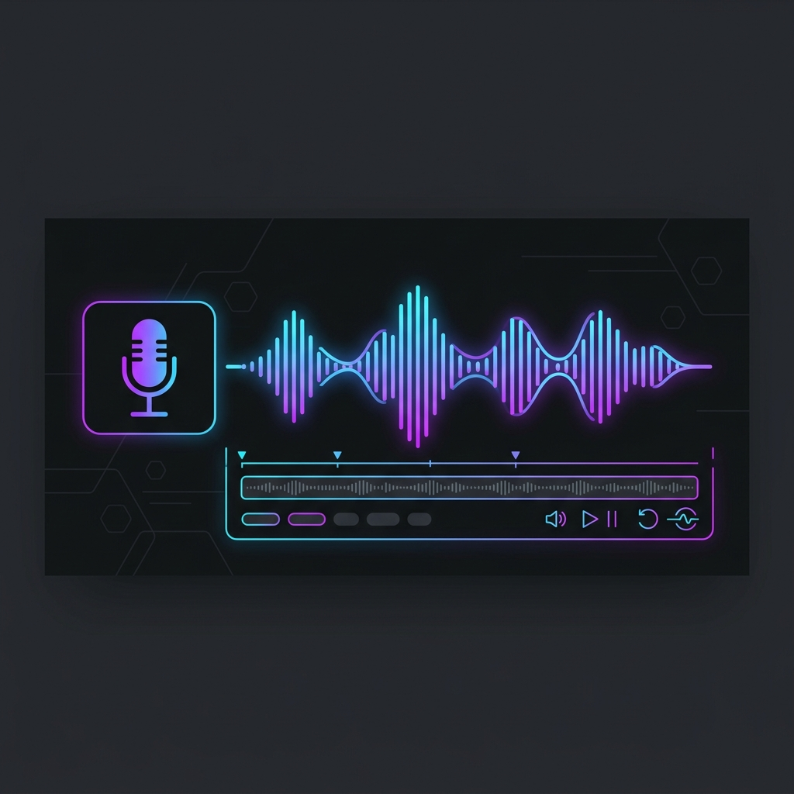

  

# ElevenLabs WebUI

A fast, local-first web interface for the ElevenLabs text-to-speech API. Built to make generating and managing audio takes easier.

## Features

- **Local Storage**: All your settings, texts, and generated history are saved locally in your browser. Nothing is lost on reload.
- **Audio Editor**: A built-in workspace to stitch, edit, and review your generated takes. You can star the best ones.
- **Fast UI**: Built with Next.js and Tailwind. Everything runs instantly without server delays.
- **Multiple Workspaces**: Supports Text-to-Speech, Sound Effects, Voice Changer, and Text-to-Dialogue.

## Setup

1. Clone the repository.
2. Run `npm install`
3. Create a `.env.local` file and add your ElevenLabs API key:
   `ELEVENLABS_API_KEY=your_key_here`
4. Run `npm run dev`
5. Open `http://localhost:3000`

## Tech Stack

- React / Next.js
- Tailwind CSS
- IndexedDB & LocalStorage for state management
- ElevenLabs API
